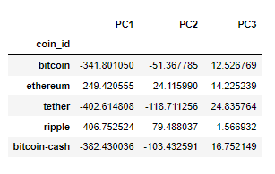

# CryptoClustering
# Background

In this challenge, I used my knowledge of Python and unsupervised learning to predict if cryptocurrencies are affected by 24-hour or 7-day price changes.

## Prepare the Data

Used the StandardScaler() module from scikit-learn to normalize the data from the CSV file.

Created a DataFrame with the scaled data and set the "coin_id" index from the original DataFrame as the index for the new DataFrame.

## Find the Best Value for k Using the Original Scaled DataFrame

Use the elbow method to find the best value for `k`

#### Answer the following question: 

**Question:** What is the best value for `k`?

**Answer:** Looking at the curve we can see that `4` is the best `k` value. 

## Cluster Cryptocurrencies with K-means Using the Original Scaled Data

Cluster the cryptocurrencies for the best value for k on the original scaled data

## Optimize Clusters with Principal Component Analysis

Using the original scaled DataFrame, perform a PCA and reduce the features to three principal components.

Retrieve the explained variance to determine how much information can be attributed to each principal component and then answer the following question in your notebook:

#### Answer the following question: 

**Question:** What is the total explained variance of the three principal components?

**Answer:** `array([9.76036771e-01, 2.30285930e-02, 7.48399221e-04])`

Create a new DataFrame with the PCA data and set the "coin_id" index from the original DataFrame as the index for the new DataFrame.

## Find the Best Value for k Using the PCA Data

Use the elbow method on the PCA data to find the best value for `k`

#### Answer the following questions: 

* **Question:** What is the best value for `k` when using the PCA data?

  * **Answer:** The best value for `k` is `3`.

* **Question:** Does it differ from the best k value found using the original data?

  * **Answer:** The data does differ from the original which showed that the best `k` value was `4`. From the data that is presented I can confer that the `3` is looking to be the best k value to populate the clusters of data. 
  
## Cluster Cryptocurrencies with K-means Using the PCA Data

Cluster the cryptocurrencies for the best value for `k` on the PCA data

* **Question:** What is the impact of using fewer features to cluster the data using K-Means?

  * **Answer:** Using less data can have several impacts on clustering the K-Means data. Some of those impacts can be on the dimensions, interpretability, and loss of information. Having fewer data and features for clustering all depends on the data you are featuring. I feel like you should be able to experiment with the diffrent clusters based on the elbow data to find the most optimal dimensions within the data to perserve as much of the original infromation while balancing the best data output. 